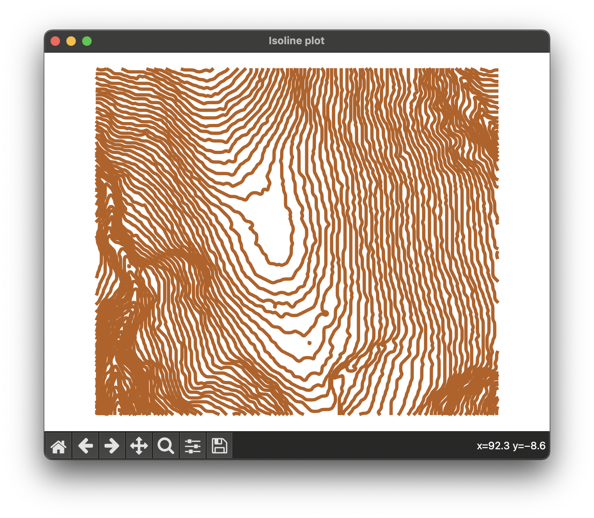
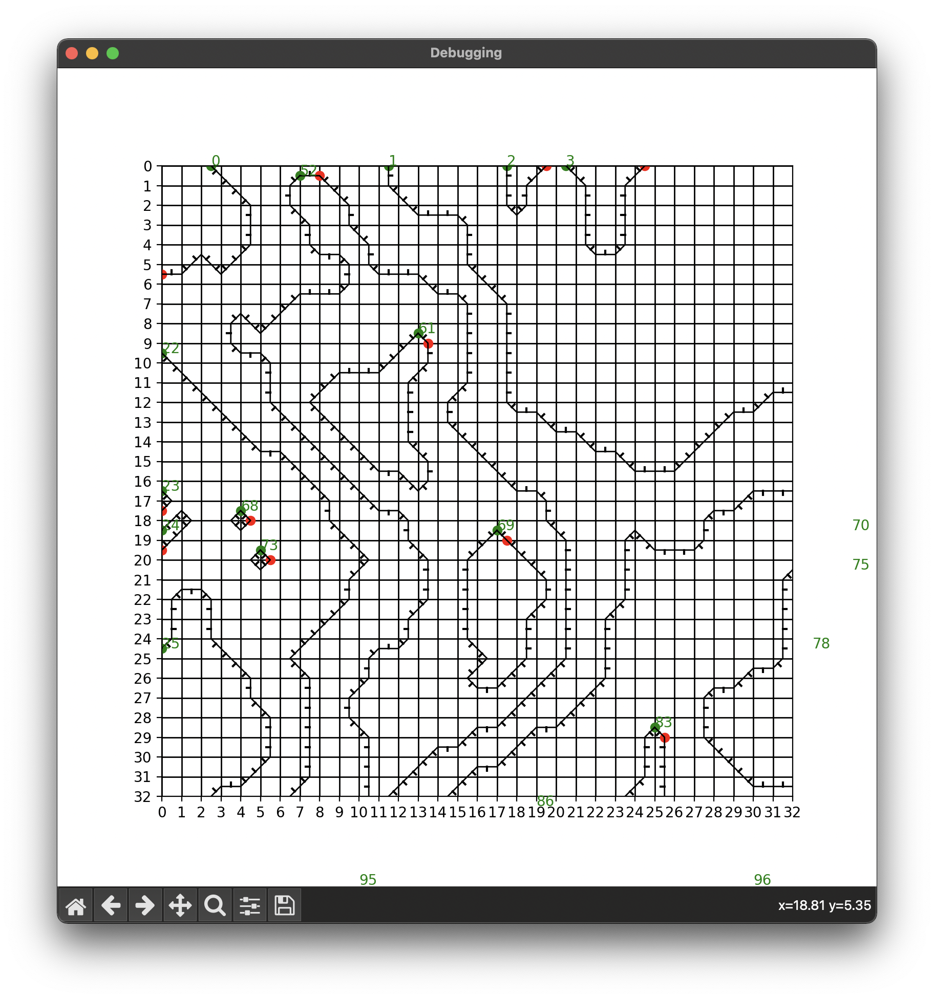

# Vector Marching Squares

(formerly a part of [TopoMC](https://github.com/ryan-mooore/topomc))



# About

This is a variation of the tried-and-true marching squares algorithm. In [this implementation](src/vector_marching_squares.py), the isolines are simultaneously created and vectorized using a 'tracing' algorithm.

# Why vectorization?

Most marching squares algorithms create discrete parts of the isolines in a visually connected raster grid. However, the underlying isoline data does not know the other grid cells it is connected to. The vectorization of the isolines enables us to process complete isolines in new ways, such as knowing where extrema such as hilltops and [depressions](<https://en.wikipedia.org/wiki/Depression_(geology)>) are, knowing the direction the slope on each side of the isoline (which way is up/down), creating graph structures describing the isolines' topological relationship to each other, and isoline smoothing.

# Running and Exporting

The script takes a matrix of integer or float values, currently represented as a `.tif` file, as the first argument. However, the code can easily be modified to take a NumPy array in the format of a `.npy` file, for example.
Although the [src/vector_marching_squares.py](src/vector_marching_squares.py) file runs the program, the actual 'tracing' algorithm is implemented in [src/tracing.py](src/tracing.py). The script exports an `isoline-paths.json` file which lists all the discrete isolines and their path coordinates, much like a `.svg` file. It also contains metadata on the direction and elevation of each isoline. The structure of the file is detailed below.

## Export file structure

```
isoline-paths.json
├─ dimensions
│   ├─ width: int
│   └─ height: int
└─ isolines
    ├─ open: Array[
    │   ┌─ path
    │   │   ├─ x: Array[int]
    │   │   └─ y: Array[int]
    │   ├─ elevation: int
    │   └─ downslope: {"left", "right"}
    │  ]
    └─ closed: Array[
        ┌─ path
        │   ├─ x: Array[int]
        │   └─ y: Array[int]
        ├─ elevation: int
        └─ type: {"depression", "hill"}
       ]
```

### Open isolines

Open isolines are not bounded entirely by the matrix area and have a start and an end. The direction of the slope (`left` or `right`) is described relative to the starting coordinates of the isoline.

### Closed isolines

Closed isolines are circular and bounded entirely by the area of the matrix. Closed isolines are always drawn in an anticlockwise direction. The direction of the slope can be determined based on the type of closed isoline:

- `hill` type means that the enclosed portion of the isoline is higher
- `depression` type means that the enclosed portion of the isoline is lower.

# Limitations

Currently the script can only export a 1 unit isoline interval. However, I hope for the program to be able to process floating point numbers and different unit intervals in the future.

# Renderer

A primitive renderer implementation can be found in [src/renderer.py](src/renderer.py). Running this file generates a simple plot of the isolines read from `isoline-paths.json`. The generated plot is shown above. In addition, this renderer implements one of the advantages of vectorization, which is isoline smoothing. They are smoothed using the `gaussian_filter1d` function from the `scipy.ndimage` package.

## Debug mode

The render also implements a simple debug view which can be activated by setting `DEBUG` to `True`. This provides up to a 32-by-32 view of the underlying marching squares process, also indicating isoline slope direction. An example of this can be seen below.

